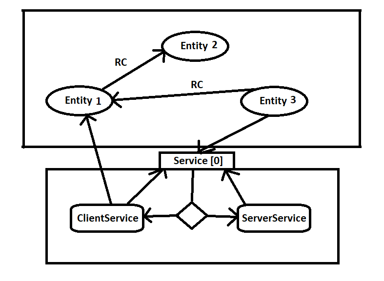

# Networking

## GameNetwork

This singleton managing all the network related communication as a server and a client.
Must be added to the scene to work.

To start a session use these methods (done by the Manager):
- `Connect`
- `Host<ServerService>`
- `HostAndConnect<ServerService>`

# Service

Both the server and the client will use a service to represent the game logic.
This is where all the "Single player manager" functionality should be.

- All service must have a `ServerService` and `ClientService` implementation and both tagged with the same `ServiceTag` 
- A service acts like a normal MonoBehaviour with an Init and Update method.
- The used service is always defined by the server.
    - The start service has to be given with the `Host<ServerService>` method with a generic parameter (`GameNetwork.Instance.Host<ServerDumy>(this);`)
    - The service can be switched by the `UseService<ServerService>` method in the `ServerService`

## Why is this good for us?

We can separate the game into smaller bits, for example.
The Lobby service responsible to wait together the players and handle a "ready" logic and after
that it can switch into a Game service where the actual game can happen.

# Entity

An entity is a network streamed object. The full lifecycle of the objects is handled by the GameNetwork.

## How to create a new type of entity

- A prefab has to be created for it.
- A new class must be inherited from the `Entity` class and attached to the prefab.
- The prefab must be stored in **Resources/Entities**

## Lifecycle

- Entities can be only instantiated in a `ServerService` with the `NetworkInstantiate<Entity>(User)`
- Entities can be only destroyed in a `ServerService` with the `NetworkDestroy(ushort)`
- A newly connected player will able to sync with the entity list on join (TODO)

## Ownership

An entity is owned by one `User` or no one (Server(0)).
You can only run your "controlling logic" on your entities. Which can be checked with the `IsMine()` method.

## Sync

An entity can have multiple `NetworkComponent` attached to the prefab which will handle a continues update on the entity.
- The `NetworkComponent`'s `OnReceive` method will run on each not owned entity the `OnSend` on the owned ones.
- The entity itself has the functionality as a `NetworkComponent` with the `OnReceive`, `OnSend` by overrideing.

# Remote Calls

A remote call enables you to call a method in a remote location. Mostly Client -> Server and Server -> Client but is also
for a Client -> Client communication.

- Remote calls can be only made in a `Service` or in a `Entity` instance.
- A method can be defined as a RC with the `RemoteCall` attribute.
- An RC can be send by using the `PrepareRC(string) : RC` method and then use the `Send` on the RC instance.
- The RC target will be always the entity where the `PrepareRC` is happened.
    - The only exception is the `Service` where it will be the inverse type. (Server -> Client, Client -> Server)
- An RC prepared on a service will be both targeted to Server & Client Service via a Service controller
    - So no duplicated RC tag can be created for Server or Client service

